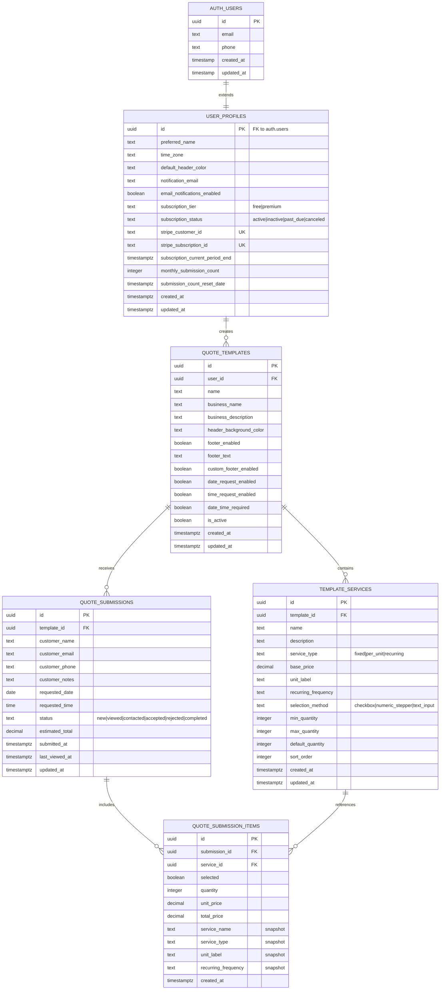
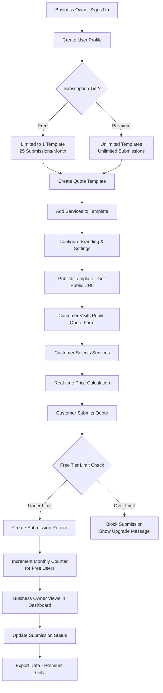
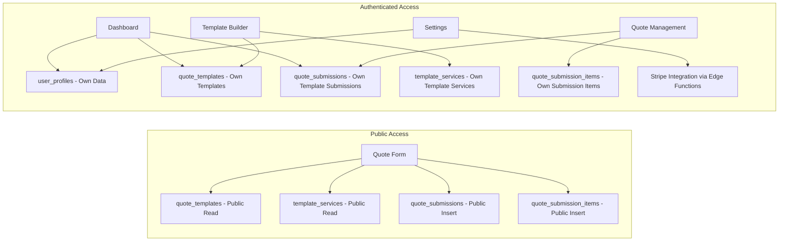

# LushQuote Database Schema Design

## Visual Schema Overview



## Business Flow Diagram



## Data Access Patterns



## Overview

This schema supports a quote generation and management platform with subscription tiers, customizable templates, and comprehensive submission tracking.

## Core Tables

### 1. Users (Auth - Already Implemented)

```sql
-- Extends Supabase auth.users
-- Additional user profile and subscription data handled in user_profiles
```

### 2. User Profiles

```sql
CREATE TABLE user_profiles (
    id UUID PRIMARY KEY REFERENCES auth.users(id) ON DELETE CASCADE,
    preferred_name TEXT,
    time_zone TEXT DEFAULT 'UTC',
    default_header_color TEXT DEFAULT '#3B82F6',
    notification_email TEXT,
    email_notifications_enabled BOOLEAN DEFAULT true,

    -- Subscription Management
    subscription_tier TEXT DEFAULT 'free' CHECK (subscription_tier IN ('free', 'premium')),
    subscription_status TEXT DEFAULT 'active' CHECK (subscription_status IN ('active', 'inactive', 'past_due', 'canceled')),
    stripe_customer_id TEXT UNIQUE,
    stripe_subscription_id TEXT UNIQUE,
    subscription_current_period_end TIMESTAMPTZ,

    -- Free Tier Limits
    monthly_submission_count INTEGER DEFAULT 0,
    submission_count_reset_date TIMESTAMPTZ DEFAULT date_trunc('month', NOW() + interval '1 month'),

    created_at TIMESTAMPTZ DEFAULT NOW(),
    updated_at TIMESTAMPTZ DEFAULT NOW()
);
```

### 3. Quote Templates

```sql
CREATE TABLE quote_templates (
    id UUID PRIMARY KEY DEFAULT gen_random_uuid(),
    user_id UUID NOT NULL REFERENCES user_profiles(id) ON DELETE CASCADE,

    -- Basic Template Info
    name TEXT NOT NULL,
    business_name TEXT NOT NULL,
    business_description TEXT,

    -- Branding & Customization
    header_background_color TEXT DEFAULT '#3B82F6',
    footer_enabled BOOLEAN DEFAULT true,
    footer_text TEXT DEFAULT 'Powered by LushQuote',
    custom_footer_enabled BOOLEAN DEFAULT false, -- Only for premium users

    -- Date/Time Request Settings
    date_request_enabled BOOLEAN DEFAULT false,
    time_request_enabled BOOLEAN DEFAULT false,
    date_time_required BOOLEAN DEFAULT false,

    -- Template Status
    is_active BOOLEAN DEFAULT true,

    -- Metadata
    created_at TIMESTAMPTZ DEFAULT NOW(),
    updated_at TIMESTAMPTZ DEFAULT NOW()
);
```

### 4. Template Services

```sql
CREATE TABLE template_services (
    id UUID PRIMARY KEY DEFAULT gen_random_uuid(),
    template_id UUID NOT NULL REFERENCES quote_templates(id) ON DELETE CASCADE,

    -- Service Details
    name TEXT NOT NULL,
    description TEXT,

    -- Service Type & Pricing
    service_type TEXT NOT NULL CHECK (service_type IN ('fixed', 'per_unit', 'recurring')),
    base_price DECIMAL(10, 2) NOT NULL DEFAULT 0,
    unit_label TEXT, -- For per_unit services (e.g., "hours", "guests")
    recurring_frequency TEXT, -- For recurring services (e.g., "monthly", "yearly")

    -- Selection Method
    selection_method TEXT NOT NULL CHECK (selection_method IN ('checkbox', 'numeric_stepper', 'text_input')),
    min_quantity INTEGER DEFAULT 1,
    max_quantity INTEGER,
    default_quantity INTEGER DEFAULT 1,

    -- Display Order
    sort_order INTEGER NOT NULL DEFAULT 0,

    -- Metadata
    created_at TIMESTAMPTZ DEFAULT NOW(),
    updated_at TIMESTAMPTZ DEFAULT NOW()
);
```

### 5. Quote Submissions

```sql
CREATE TABLE quote_submissions (
    id UUID PRIMARY KEY DEFAULT gen_random_uuid(),
    template_id UUID NOT NULL REFERENCES quote_templates(id) ON DELETE CASCADE,

    -- Customer Information
    customer_name TEXT NOT NULL,
    customer_email TEXT NOT NULL,
    customer_phone TEXT,
    customer_notes TEXT,

    -- Date/Time Requests
    requested_date DATE,
    requested_time TIME,

    -- Submission Status
    status TEXT DEFAULT 'new' CHECK (status IN ('new', 'viewed', 'contacted', 'accepted', 'rejected', 'completed')),

    -- Calculated Totals
    estimated_total DECIMAL(10, 2) NOT NULL DEFAULT 0,

    -- Metadata
    submitted_at TIMESTAMPTZ DEFAULT NOW(),
    last_viewed_at TIMESTAMPTZ,
    updated_at TIMESTAMPTZ DEFAULT NOW()
);
```

### 6. Quote Submission Items

```sql
CREATE TABLE quote_submission_items (
    id UUID PRIMARY KEY DEFAULT gen_random_uuid(),
    submission_id UUID NOT NULL REFERENCES quote_submissions(id) ON DELETE CASCADE,
    service_id UUID NOT NULL REFERENCES template_services(id) ON DELETE CASCADE,

    -- Selected Quantities/Options
    selected BOOLEAN DEFAULT false,
    quantity INTEGER DEFAULT 1,

    -- Pricing at Time of Submission (for historical accuracy)
    unit_price DECIMAL(10, 2) NOT NULL,
    total_price DECIMAL(10, 2) NOT NULL,

    -- Service Details (snapshot for historical data)
    service_name TEXT NOT NULL,
    service_type TEXT NOT NULL,
    unit_label TEXT,
    recurring_frequency TEXT,

    created_at TIMESTAMPTZ DEFAULT NOW()
);
```

## Indexes for Performance

```sql
-- User profiles
CREATE INDEX idx_user_profiles_subscription_tier ON user_profiles(subscription_tier);
CREATE INDEX idx_user_profiles_stripe_customer ON user_profiles(stripe_customer_id);

-- Templates
CREATE INDEX idx_quote_templates_user_id ON quote_templates(user_id);
CREATE INDEX idx_quote_templates_active ON quote_templates(user_id, is_active);

-- Template services
CREATE INDEX idx_template_services_template_id ON template_services(template_id);
CREATE INDEX idx_template_services_sort_order ON template_services(template_id, sort_order);

-- Submissions
CREATE INDEX idx_quote_submissions_template_id ON quote_submissions(template_id);
CREATE INDEX idx_quote_submissions_status ON quote_submissions(status);
CREATE INDEX idx_quote_submissions_submitted_at ON quote_submissions(submitted_at DESC);
CREATE INDEX idx_quote_submissions_template_status ON quote_submissions(template_id, status);

-- Submission items
CREATE INDEX idx_quote_submission_items_submission_id ON quote_submission_items(submission_id);
CREATE INDEX idx_quote_submission_items_service_id ON quote_submission_items(service_id);
```

## Row Level Security (RLS) Policies

```sql
-- Enable RLS on all tables
ALTER TABLE user_profiles ENABLE ROW LEVEL SECURITY;
ALTER TABLE quote_templates ENABLE ROW LEVEL SECURITY;
ALTER TABLE template_services ENABLE ROW LEVEL SECURITY;
ALTER TABLE quote_submissions ENABLE ROW LEVEL SECURITY;
ALTER TABLE quote_submission_items ENABLE ROW LEVEL SECURITY;

-- User Profiles Policies
CREATE POLICY "Users can view own profile" ON user_profiles FOR SELECT USING (auth.uid() = id);
CREATE POLICY "Users can update own profile" ON user_profiles FOR UPDATE USING (auth.uid() = id);
CREATE POLICY "Users can insert own profile" ON user_profiles FOR INSERT WITH CHECK (auth.uid() = id);

-- Quote Templates Policies
CREATE POLICY "Users can view own templates" ON quote_templates FOR SELECT USING (auth.uid() = user_id);
CREATE POLICY "Users can insert own templates" ON quote_templates FOR INSERT WITH CHECK (auth.uid() = user_id);
CREATE POLICY "Users can update own templates" ON quote_templates FOR UPDATE USING (auth.uid() = user_id);
CREATE POLICY "Users can delete own templates" ON quote_templates FOR DELETE USING (auth.uid() = user_id);

-- Public access for quote forms
CREATE POLICY "Public can view active templates" ON quote_templates FOR SELECT USING (is_active = true);

-- Template Services Policies
CREATE POLICY "Users can manage services for own templates" ON template_services FOR ALL USING (
    EXISTS (
        SELECT 1 FROM quote_templates
        WHERE quote_templates.id = template_services.template_id
        AND quote_templates.user_id = auth.uid()
    )
);

-- Public access for quote forms
CREATE POLICY "Public can view services for active templates" ON template_services FOR SELECT USING (
    EXISTS (
        SELECT 1 FROM quote_templates
        WHERE quote_templates.id = template_services.template_id
        AND quote_templates.is_active = true
    )
);

-- Quote Submissions Policies
CREATE POLICY "Template owners can view submissions" ON quote_submissions FOR SELECT USING (
    EXISTS (
        SELECT 1 FROM quote_templates
        WHERE quote_templates.id = quote_submissions.template_id
        AND quote_templates.user_id = auth.uid()
    )
);

CREATE POLICY "Template owners can update submissions" ON quote_submissions FOR UPDATE USING (
    EXISTS (
        SELECT 1 FROM quote_templates
        WHERE quote_templates.id = quote_submissions.template_id
        AND quote_templates.user_id = auth.uid()
    )
);

CREATE POLICY "Template owners can delete submissions" ON quote_submissions FOR DELETE USING (
    EXISTS (
        SELECT 1 FROM quote_templates
        WHERE quote_templates.id = quote_submissions.template_id
        AND quote_templates.user_id = auth.uid()
    )
);

-- Public can insert submissions (for quote forms)
CREATE POLICY "Public can submit quotes" ON quote_submissions FOR INSERT WITH CHECK (true);

-- Quote Submission Items Policies
CREATE POLICY "Template owners can view submission items" ON quote_submission_items FOR SELECT USING (
    EXISTS (
        SELECT 1 FROM quote_submissions qs
        JOIN quote_templates qt ON qt.id = qs.template_id
        WHERE qs.id = quote_submission_items.submission_id
        AND qt.user_id = auth.uid()
    )
);

-- Public can insert submission items (for quote forms)
CREATE POLICY "Public can insert submission items" ON quote_submission_items FOR INSERT WITH CHECK (true);
```

## Triggers and Functions

### 1. Update Timestamps

```sql
-- Generic updated_at trigger function
CREATE OR REPLACE FUNCTION update_updated_at_column()
RETURNS TRIGGER AS $$
BEGIN
    NEW.updated_at = NOW();
    RETURN NEW;
END;
$$ LANGUAGE plpgsql;

-- Apply to all tables with updated_at
CREATE TRIGGER update_user_profiles_updated_at BEFORE UPDATE ON user_profiles FOR EACH ROW EXECUTE FUNCTION update_updated_at_column();
CREATE TRIGGER update_quote_templates_updated_at BEFORE UPDATE ON quote_templates FOR EACH ROW EXECUTE FUNCTION update_updated_at_column();
CREATE TRIGGER update_template_services_updated_at BEFORE UPDATE ON template_services FOR EACH ROW EXECUTE FUNCTION update_updated_at_column();
CREATE TRIGGER update_quote_submissions_updated_at BEFORE UPDATE ON quote_submissions FOR EACH ROW EXECUTE FUNCTION update_updated_at_column();
```

### 2. Auto-reset Monthly Submission Counter

```sql
CREATE OR REPLACE FUNCTION reset_monthly_submission_count()
RETURNS TRIGGER AS $$
BEGIN
    -- Check if we need to reset the counter
    IF NEW.submission_count_reset_date <= NOW() THEN
        NEW.monthly_submission_count = 0;
        NEW.submission_count_reset_date = date_trunc('month', NOW() + interval '1 month');
    END IF;
    RETURN NEW;
END;
$$ LANGUAGE plpgsql;

CREATE TRIGGER auto_reset_submission_count BEFORE UPDATE ON user_profiles FOR EACH ROW EXECUTE FUNCTION reset_monthly_submission_count();
```

### 3. Template Limit Enforcement

```sql
CREATE OR REPLACE FUNCTION enforce_template_limits()
RETURNS TRIGGER AS $$
DECLARE
    user_tier TEXT;
    template_count INTEGER;
BEGIN
    -- Get user's subscription tier
    SELECT subscription_tier INTO user_tier
    FROM user_profiles
    WHERE id = NEW.user_id;

    -- Count existing templates
    SELECT COUNT(*) INTO template_count
    FROM quote_templates
    WHERE user_id = NEW.user_id AND is_active = true;

    -- Enforce free tier limit (1 template)
    IF user_tier = 'free' AND template_count >= 1 THEN
        RAISE EXCEPTION 'Free tier users are limited to 1 active template. Upgrade to Premium for unlimited templates.';
    END IF;

    RETURN NEW;
END;
$$ LANGUAGE plpgsql;

CREATE TRIGGER enforce_template_limits BEFORE INSERT ON quote_templates FOR EACH ROW EXECUTE FUNCTION enforce_template_limits();
```

### 4. Submission Counter Increment

```sql
CREATE OR REPLACE FUNCTION increment_submission_counter()
RETURNS TRIGGER AS $$
DECLARE
    template_owner_id UUID;
    owner_tier TEXT;
    current_count INTEGER;
BEGIN
    -- Get template owner info
    SELECT qt.user_id, up.subscription_tier, up.monthly_submission_count
    INTO template_owner_id, owner_tier, current_count
    FROM quote_templates qt
    JOIN user_profiles up ON up.id = qt.user_id
    WHERE qt.id = NEW.template_id;

    -- Only increment for free tier users
    IF owner_tier = 'free' THEN
        -- Check if limit exceeded (25 submissions per month)
        IF current_count >= 25 THEN
            RAISE EXCEPTION 'Monthly submission limit (25) exceeded. Upgrade to Premium for unlimited submissions.';
        END IF;

        -- Increment counter
        UPDATE user_profiles
        SET monthly_submission_count = monthly_submission_count + 1
        WHERE id = template_owner_id;
    END IF;

    RETURN NEW;
END;
$$ LANGUAGE plpgsql;

CREATE TRIGGER increment_submission_counter AFTER INSERT ON quote_submissions FOR EACH ROW EXECUTE FUNCTION increment_submission_counter();
```

## Views for Common Queries

### 1. Template with Service Count

```sql
CREATE VIEW template_summary AS
SELECT
    qt.*,
    up.preferred_name as owner_name,
    up.subscription_tier,
    COUNT(ts.id) as service_count,
    COUNT(CASE WHEN qs.status = 'new' THEN 1 END) as new_submissions,
    COUNT(qs.id) as total_submissions
FROM quote_templates qt
JOIN user_profiles up ON up.id = qt.user_id
LEFT JOIN template_services ts ON ts.template_id = qt.id
LEFT JOIN quote_submissions qs ON qs.template_id = qt.id
GROUP BY qt.id, up.preferred_name, up.subscription_tier;
```

### 2. Submission Summary with Template Info

```sql
CREATE VIEW submission_summary AS
SELECT
    qs.*,
    qt.name as template_name,
    qt.business_name,
    up.preferred_name as owner_name,
    COUNT(qsi.id) as item_count
FROM quote_submissions qs
JOIN quote_templates qt ON qt.id = qs.template_id
JOIN user_profiles up ON up.id = qt.user_id
LEFT JOIN quote_submission_items qsi ON qsi.submission_id = qs.id
GROUP BY qs.id, qt.name, qt.business_name, up.preferred_name;
```

## Migration Considerations

1. **Data Migration from Base44**: You'll need to map existing data to these new structures
2. **Stripe Integration**: Ensure webhook handlers update the `user_profiles` table correctly
3. **File Storage**: Consider using Supabase Storage for any file uploads (logos, etc.)
4. **Real-time Features**: Leverage Supabase real-time subscriptions for live updates
5. **Edge Functions**: Move existing Base44 functions to Supabase Edge Functions

## Performance Notes

- All foreign keys have proper indexes
- RLS policies are optimized to avoid expensive joins where possible
- Submission counter is handled via triggers for consistency
- Views pre-aggregate common data patterns
- Consider adding materialized views for heavy analytics queries

## Security Considerations

- All sensitive operations require authentication
- Public endpoints only expose necessary data for quote forms
- Subscription limits are enforced at the database level
- Historical data is preserved even if templates/services are modified
